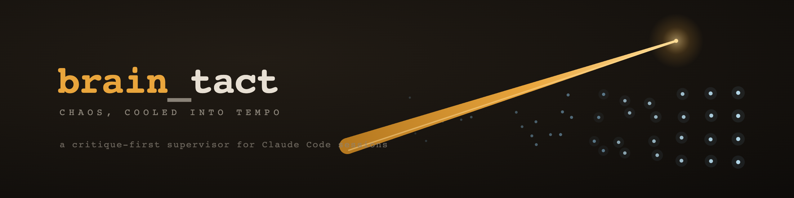
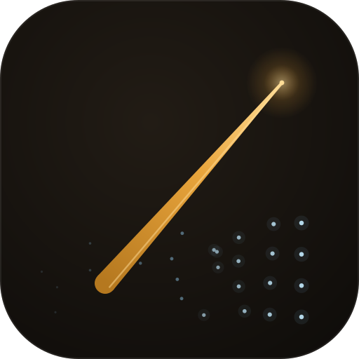

<p align="center">
  
</p>

#  brain_tact

> **指揮者が、散らかった Claude Code セッションを統率する。**
> `brain` = 状況を判断する脳 ／ `tact` = 複数を束ねるタクト(指揮棒)

ターミナルで 20〜30 個の Claude Code を並行運用すると、作業途中のまま放置されたウィンドウが溜まっていく。**brain_tact** はそれらを閉じさせず、批判的に改善を促し続ける監督ツール。

定時(朝7/昼12/夕17/夜22時)に全セッションを巡回し、ヘッドレスの Claude が状態を判断する — **批判的改善ファースト**。「完了」報告を鵜呑みにせず粗・改善余地を指摘して自己改善ループを促し、止まったものは動かし、落ちたものは復元する。**セッションは閉じさせない**。判断が要るものだけ保留にして、ダッシュボードと LINE に報告する。

```
        🎼 指揮者(brain)
         │ 定時巡回 7/12/17/22時
   ┌─────┼─────┬─────┬─────┐
  ▶稼働  🔬要改善   🔁改善ループ  ⏸保留   ← 完了を疑い、改善を止めさせない
   触らず  粗を指摘   自己改善促す   /brainで対話
```

<sub>🎨 ロゴ: 「Conducted Field」— タクト1本が散らばった光点(セッション)を秩序へ resolve する。4案: [A/downbeat](assets/logo-a-downbeat.svg)・[B/tempo](assets/logo-b-tempo.svg)・[C/tip](assets/logo-c-tip.svg)・[D/rows](assets/logo-d-rows.svg) / [デザイン哲学](assets/design-philosophy.md)</sub>

---

## 3つの入口(どこからでもbrain)

| 入口 | 用途 |
|---|---|
| **MCP** (`brain`) | Claude Code/アプリから `scan_now` `get_cleanup` `run_cycle_now` `act_*` を呼ぶ。userスコープ登録済み(登録後の新セッションで有効) |
| **CLI** (`brain-tact`) | `scan` `cleanup` `send` `approve` `resume` `cycle` `serve` `pending` `doctor` `stats` |
| **HTTP API** (`serve`) | localhost:8787。`GET /api/state`(状態+判定) `POST /api/act`(介入) `POST /api/scan`。Tin/AtelierXはこれをfetch |

### 外部から機能を呼ぶ(埋め込み前の統合)

```bash
# 状態取得(判定込み)
curl -s http://127.0.0.1:8787/api/state | jq .headline

# セッションに指示を送る(CLI・手動なのでクールダウンなし)
brain-tact send /dev/ttys006 "pushして締めてください"
brain-tact approve /dev/ttys007 1        # 承認プロンプトに"1"
brain-tact resume /dev/ttys003           # 死んだタブを復元

# HTTP経由(Tin/AtelierXのIPCから叩く形)。POSTは X-Brain-Token 必須
# (トークンは state/dashboard-token に自動生成。ブラウザCSRF対策)
curl -s -X POST http://127.0.0.1:8787/api/act \
  -H "X-Brain-Token: $(cat state/dashboard-token)" \
  -d '{"tool":"act_send","tty":"/dev/ttys006","message":"pushして"}'
```

**手動(CLI/ダッシュボード)操作はクールダウン・回数制限をバイパス**(脳の暴走防止用ガードレールは脳の自動巡回にのみ適用)。禁止語句・claude在席チェックは手動でも維持。

```
launchd (7/12/17/22時)
  └─ brain-tact cycle
       ├─ ① scan: AppleScript(全タブ画面) + ps/lsof(プロセス→cwd) + jsonl mtime
       ├─ ② 脳 = claude -p (sonnet・15分タイムアウト・MCP 2つのみ)
       │     ├─ brain-actuator: act_send / act_approve / act_resume / defer
       │     │   (クールダウン・回数上限・禁止語句をコードで強制)
       │     └─ line-bridge: send_text (1サイクル1push)
       └─ ③ pending.json更新 / actions.log監査記録
ユーザー: LINEで受信 → 手元のClaude Codeで /brain → 対話で保留を処理
```

## 判断ポリシー

| セッション状態 | 脳の対応 |
|---|---|
| RUNNING(スピナーあり) | 触らない |
| IDLE(最終活動<60分) | 触らない(ユーザー作業中の可能性) |
| **完了報告で停止** | **鵜呑みにせず批判的に粗を指摘 → 次の改善を1つ促す(閉じさせない)** |
| IDLE(放置) | 「批判的に自己レビューし最も価値ある改善を実行→ループ継続」を送信 |
| AWAITING_APPROVAL | 安全(読取/編集/ビルド/テスト/commit)なら自動承認、危険(rm -rf/push/sudo/課金)なら保留 |
| DEAD_SHELL(claude死亡) | `claude --continue` で**復元**(閉じさせない) |
| ERROR_RETRYING | 自動回復を待つ(報告のみ) |
| LIMIT_REACHED | 保留(ユーザー判断) |
| 2回突いて進展なし | 3ストライク → 保留へ昇格 |

> **方針(重要)**: brainは肯定する脳ではなく、より良くするために**批判する脳**。「閉じて/締めて/clear」は送らない。完了報告こそ改善の起点。

ガードレール(actuatorがコードで強制、プロンプト任せにしない):

- act_send: 同一tty **6時間に1回** / claude不在タブへの送信拒否(シェル誤爆防止) / 危険語句拒否
- act_approve: 選択肢番号のみ / 1セッション3回まで
- act_resume: claude稼働中タブには拒否 / **12時間に1回**
- 合計: **1サイクル15アクションまで** / kill・タブ閉じのツールは存在しない
- 全アクションが `state/actions.log` に自動記録(脳の自己申告に依存しない)

## セットアップ

```bash
cd <brain_tact>
# .venv は iCloud(~/Documents)外に作る ← 重要(下記「既知の罠」)
UV_PROJECT_ENVIRONMENT="$HOME/.venvs/brain_tact" uv sync

VENV="$HOME/.venvs/brain_tact/bin/python"
PYTHONPATH=src $VENV -m brain_tact.cli scan                     # 状態分類を確認
PYTHONPATH=src $VENV -m brain_tact.cli cycle --force --dry-run  # 脳のドライラン
PYTHONPATH=src $VENV -m brain_tact.cli install --launchd        # launchd登録(7/12/17/22時)
PYTHONPATH=src $VENV -m brain_tact.cli install --skill          # /brainスキル配置
```

> **既知の罠(iCloud)**: `~/Documents` は iCloud 同期対象で、その配下に `.venv` を置くと
> uv の editable `.pth` が競合コピー(`brain_tact 2.pth`)で壊され `ModuleNotFoundError` が
> 断続発生する。**`.venv` は iCloud外(`~/.venvs/`)に置き、起動は `uv run` ではなく
> venv の python を直接呼ぶ**(全 launchd / MCP / CLI 経路でこの方式に統一済み)。

## コマンド

| コマンド | 用途 |
|---|---|
| `brain-tact scan [--quick] [--json]` | 全タブスキャン+状態分類 |
| `brain-tact cleanup [--scan] [--json]` | 🔬 セッション判定(要改善/満杯/稼働)を表示 |
| `brain-tact serve [--port N]` | 📊 ダッシュボードをlocalhostで起動 |
| `brain-tact cycle [--force] [--dry-run] [--model X]` | 巡回サイクル実行 |
| `brain-tact pending [list\|resolve <id> --note N]` | 保留リスト操作 |
| `brain-tact log [--tail N]` | 脳のアクション監査ログ |
| `brain-tact doctor` | 環境・権限・直近サイクルの自己診断 |
| `brain-tact stats [--days N]` | KPI(介入成功率・稼働率推移) |
| `brain-tact install [--launchd] [--skill] [--dry-run]` | インストール |

> メニューバーアプリ(`brain-tact-app`, rumps製)もあるが、本命は **ダッシュボード(`serve`)** と **MCP(`brain`)**。Tin/AtelierXからは `GET /api/state` か MCP を叩いて統合する。

## デスクトップアプリ(.app)

`electron/` に Electron シェルアプリ。常駐ダッシュボードを独立ウィンドウ + tray(メニューバー)で表示する(機能は Python core 側、Electron は窓と tray だけ — 引き算)。

```bash
cd electron
npm install
npm start          # 開発起動(ダッシュボードに接続、無ければ Python serve を自動起動)
npm run build:mac  # dist/ に brain_tact.app / .dmg を生成
```

- tray アイコン(ロゴ)クリックでウィンドウ表示/非表示トグル
- ウィンドウを閉じても tray に常駐(終了は tray メニューから)

## 攻めモード(誰もサボらせない)

usage(Claude利用枠、ccusage計測)が**50%未満**のとき:

- 残作業のないIDLEセッションに「改善候補を3つ提案し、最有力に着手して」を送る
- **読書係**(読み取り専用ヘッドレスclaude)が、セッションの開いていない放置プロジェクト(~/Documents/GitHub を2階層走査、7日ローテーション)を読み直し、現状+次の一手3案を生成
- 結果はLINEレポートの「💡提案」としてホウレンソウ(push数は増やさない)

## 閉ループ(入力した→効いたか)

介入は次サイクルで自動検証され(`verify`: reactivated/no_change/worse)、
連続2回不発のセッションへの送信はactuatorが拒否(3ストライク)。
効果はLINEレポートの「🔍前回介入の効果」と `brain-tact stats` で確認できる。

## /brain スキル

手元のClaude Codeで `/brain` と打つと、保留項目の一覧 → 対話で指示出し → 消し込み、ができる。LINEレポートに「→ 手元のClaude Codeで /brain」と出たらこれ。

## 運用メモ

- **デバウンス**: 前回成功から3時間未満のサイクルはスキップ(Macスリープ起床時に溜まった発火が1回にまとまる)。手動実行は `--force`
- **スリープ中は発火しない**: launchdは起床時に1回まとめ実行する。蓋閉じ運用で朝7時を確実にしたいなら:
  `sudo pmset repeat wakeorpoweron MTWRFSU 06:58:00`(1日1回のみ設定可)
- **LINE枠**: 無料枠は月200push。4回/日=120push/月で、他用途と合算すると逼迫し得る。逼迫したら22時/7時の2回に減らす(plistの`StartCalendarInterval`を編集して `install --launchd` で再登録)
- **claude-watchdogとの棲み分け**: watchdog=30秒間隔のクラッシュ即時復活(常駐)、brain_tact=定時の状況判断・介入・報告。両方併用する
- **タイムアウト**: 脳は15分でSIGKILL。失敗時はLINEに障害一報(それも失敗したら `state/cycle.log` のみ)
- **state/** はgit管理外(スナップショット履歴は14日、保留は48時間で自動期限切れ)

## テスト

```bash
uv run pytest tests/ -q
```

実機画面のfixture(`tests/fixtures/screens/`)で状態分類を回帰テストする。Claude CodeのTUI表示が変わって分類がおかしくなったら、`brain-tact scan --json` で実画面を取って新fixtureを追加すること。
